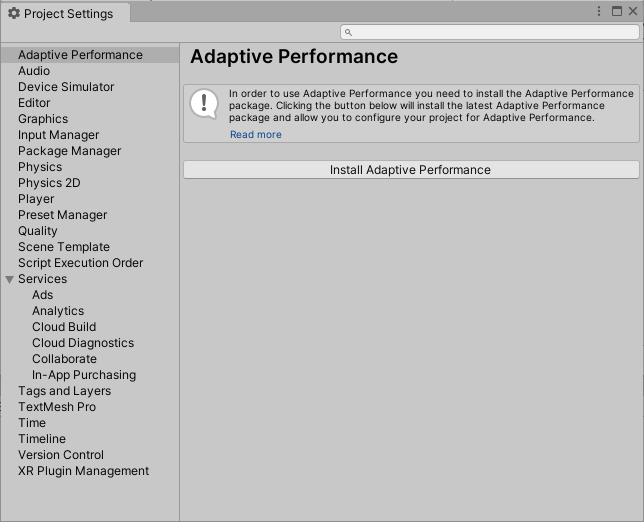
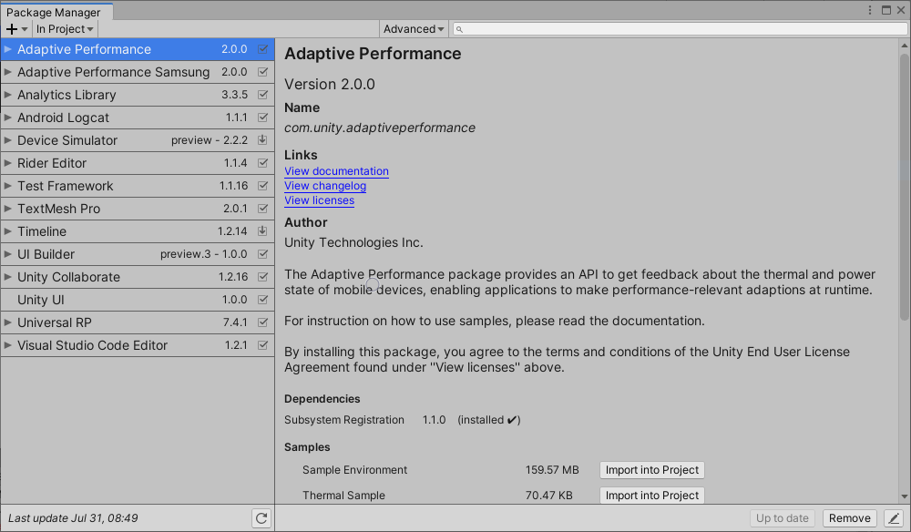
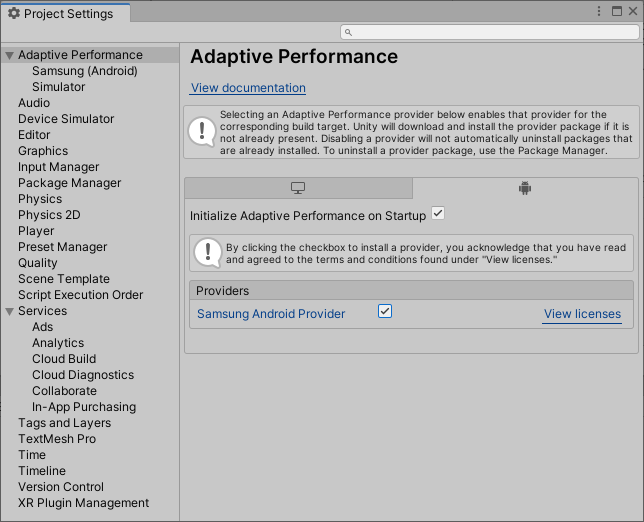

# Installing Adaptive Performance

You can install the package in one of the following ways:

- From the [Project Settings](#project-settings) window
- From the [Unity Package Manager](#unity-package-manager)
- Manually from the [Package Manifest](#package-manifest)

### Project Settings

Access the **Project Settings** window (menu: **Edit &gt; Project Settings &gt; Adaptive Performance**), then click the **Install Adaptive Performance** button.



### Unity Package Manager

Use the [Unity Package Manager](https://docs.unity3d.com/Packages/com.unity.package-manager-ui@latest/index.html) to install the Adaptive Performance package.



### Package manifest

You can also install Adaptive Performance manually. To do this, add a reference to Adaptive Performance in your Project's `Packages/manifest.json` file. There are two ways you can reference a specific version of the Adaptive Performance package, depending on how you use it.

#### Using a production version of the package

You can point the Package Manager at a publicly available version. To do this manually, add it to `manifest.json`:

```json
    "dependencies": {
        //...
        "com.unity.adaptiveperformance":"<full version number>"
    }
```

#### Using a local clone of the package

If you want to use a cloned version of the package, you can point the Package Manager at a local folder as the package location:

```json
    "dependencies": {
        //...
        "com.unity.adaptiveperformance":"file:path/to/package/root"
    }
```

**Note:** The root of the package folder isn't necessarily the root of the cloned repository. The root of the package folder is the folder that contains the `package.json` file.

## Provider installation

Adaptive Performance only works in combination with data provider subsystems. You can install and enable these providers for individual platforms from the **Adaptive Performance** section of the **Project Settings** window.



To use Adaptive Performance, you must install and activate at least one subsystem. This version of Adaptive Performance supports the following subsystems:

* [Samsung (Android)](https://docs.unity3d.com/Packages/com.unity.adaptiveperformance.samsung.android@latest/index.html)
* [Simulator (Desktop)](simulator.md)
