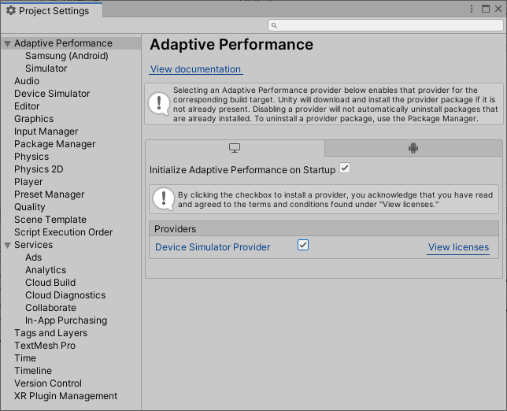
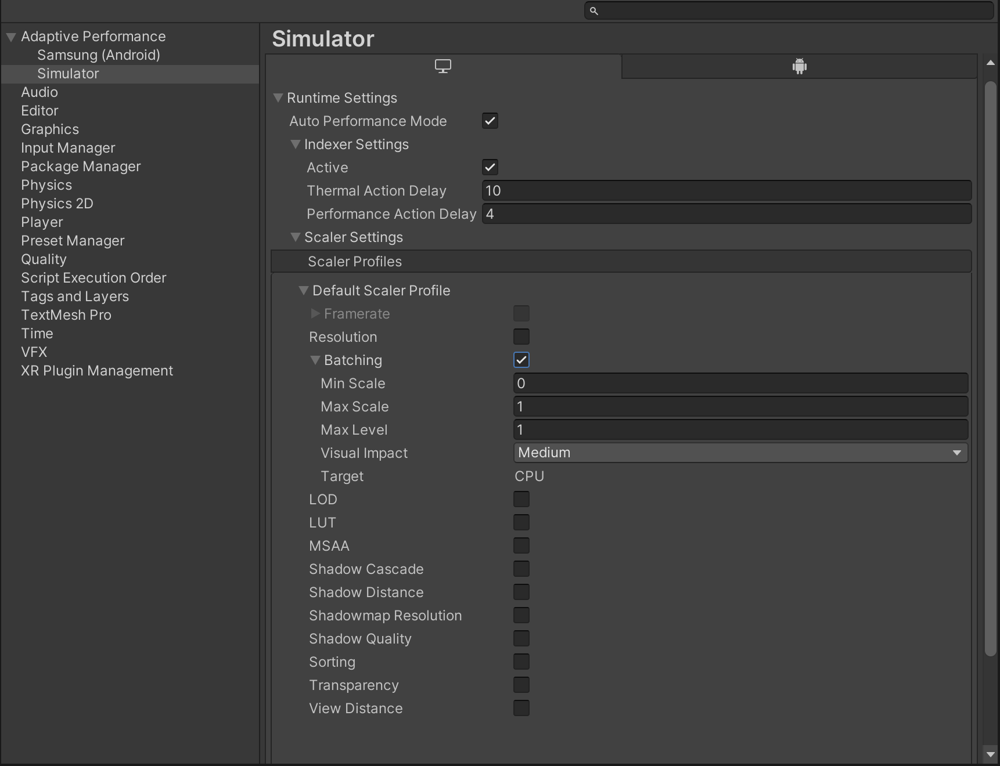
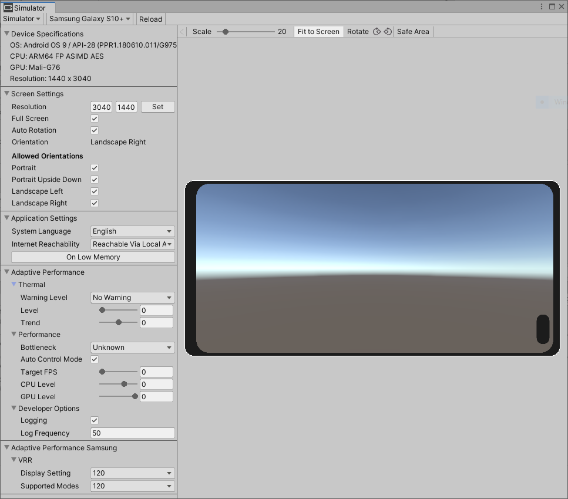

# Adaptive Performance Simulator

Adaptive Performance adds a section of controls to the [Device Simulator](https://docs.unity3d.com/Packages/com.unity.device-simulator@latest) window to let you simulate thermal and bottleneck events in the Editor. This should help you to test your Adaptive Performance implementations in the Editor without the need to deploy your app to a device. The plugin uses the `SimulatorAdaptivePerformanceSubsystem` to simulate the events.

When you install the Adaptive Performance package, Unity automatically installs the Simulator provider. To enable the Simulator, you must:

* [Activate](installing-and-configuring.md#provider-installation) the Simulator provider for Desktop platforms in the **Project Settings** window
* In Unity 2021 and above, the Device Simulator is already included in the Unity Editor.

The simulator provider has several settings for development and runtime, which are available for each individual provider. For more information, see the [Adaptive Performance user guide](user-guide.md).

## Device Simulator window

After you install Adaptive Performance, the **Device Simulator** window will display the following additional settings to simulate various thermal and bottleneck conditions:

### Thermal
* Warning Level - Simulates a thermal warning level. The options are No Warning, Throttling Imminent, and Throttling.
* Level - The temperature level simulates the skin temperature level of a device. Options range between nominal temperature (0) and critical throttling temperature (maximum level of 1.0).
* Trend - Temperature trends with a value below 0 simulate a temperature drop. Values higher than 0 simulate a temperature increase.

### Performance
* Bottleneck - Simulate the device bottleneck, which can be CPU, GPU, or target frame rate bound. Target framerate is either VSync or the value set in [Application.TargetFramerate](https://docs.unity3d.com/ScriptReference/Application-targetFrameRate.html).
* Auto Control Mode - Sets CPU and GPU level automatically. If the system is throttling performance, the Control Mode is set to System and Auto Control Mode has no influence.
* Target FPS - Simulates the application target framerate in frames per second.
* CPU Level - Simulates the frequency cap of the CPU in discrete levels.
* GPU Level - Simulates the frequency cap of the GPU in discrete levels.
* CPU Boost - CPU Boost enables CPU Boost for 10 seconds. Enabling CPU boost disables CPU levels until the boost is over. If the system is throttling the CPU boost has no effect.
* GPU Boost - GPU Boost enables GPU Boost for 10 seconds. Enabling GPU boost disables GPU levels until the boost is over. If the system is throttling the GPU boost has no effect.

### Developer Options
* Logging - Enable or disable logging from the Adaptive Performance subsystem.
* Logging Frequency - Control Adaptive Performance logging frequency in frames.

Adaptive Performance also includes an API that you can use to script thermal and bottleneck changes.

### Indexer and Scalers

The Indexer and Scalers may also be used with the Device Simulator. In this section you will find a list of all the available Scalers. Each one will have the following options:

* A toggle to enable or disable the Scaler.
* A integer field to enter a value or reflect the current value (override level) of the Scaler.
* A integer field to enter the Max Level for the scaler.
* A float field to enter the Min Scale for the scaler.
* A float field to enter the Max Scale for the scaler.

In addition there are two options to override the current actions taken by the Indexer.

* Thermal Action
* Performance Action

Both of them have the same options: Stale, Increase, Decrease and Fast Decrease. These correlate to the action that the Indexer will take to adjust the visual quality level to regulate the device temperature and/or app performance. In other words if the device temperature is increasing or if performance is suffering the Indexer would normally set the actions to Decrease or Fast Decrease depending upon how severe the impact is to decrease visual quality until thermal or performance state become stable again.

But if the device temperature and performance are both good then it will decide that it is safe to increase the visual quality. If no change is necessary or desired then the action is set to Stale.

For more information about the individual scalers see the  [user guide](user-guide.md#indexer-and-scalers).
