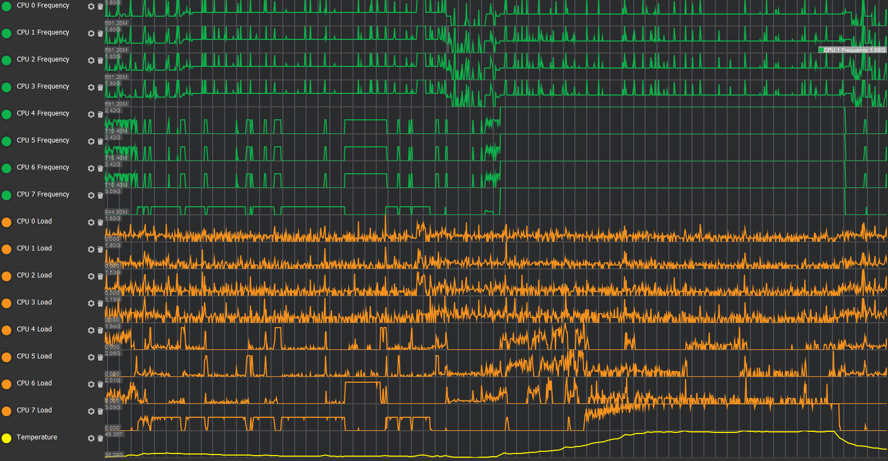
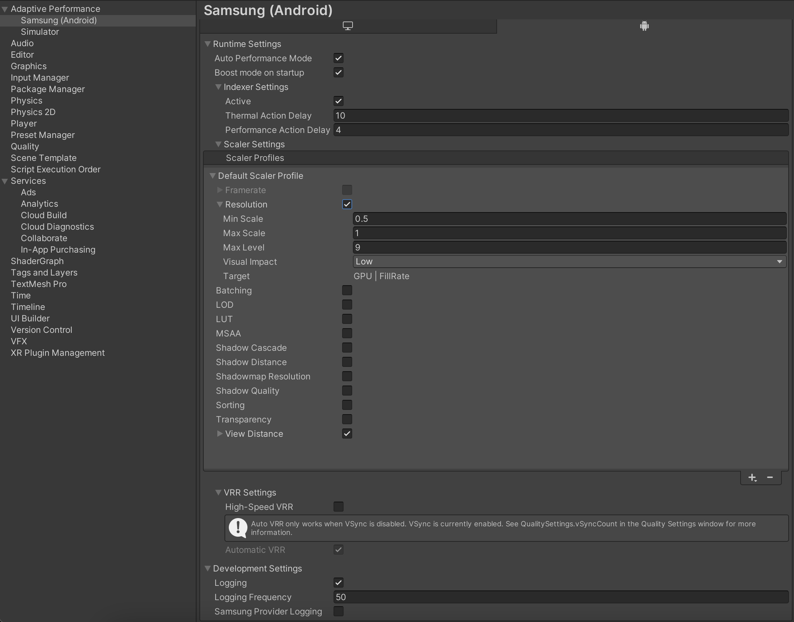
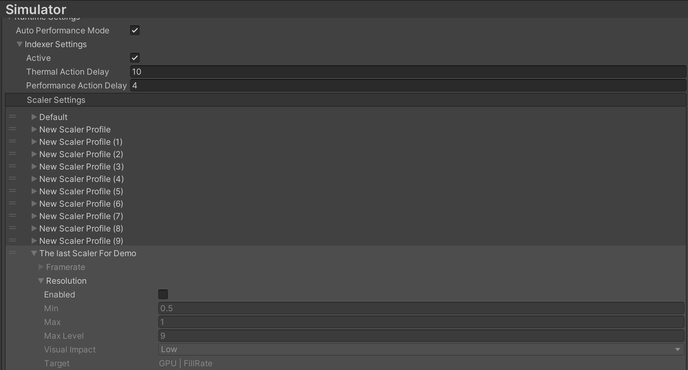
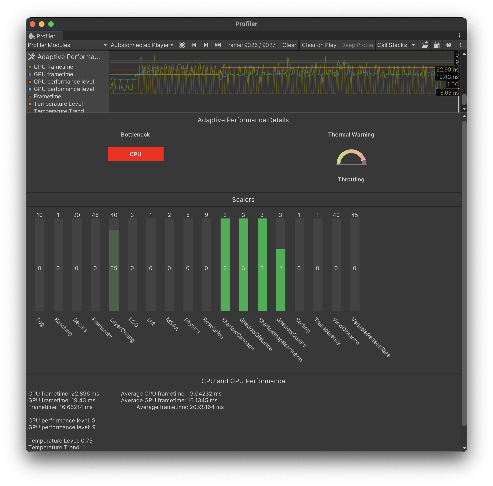

# Adaptive Performance user guide

When you install the Adaptive Performance package, Unity automatically creates a GameObject that implements `IAdaptivePerformance` in your Project at runtime. To access the instance, use `UnityEngine.AdaptivePerformance.Holder.Instance`.

To check if your device supports Adaptive Performance, use the `Instance.Active` property. To get detailed information during runtime, enable debug logging in the provider settings or via the `Instance.DevelopmentSettings.Logging` during runtime or via boot time flags from the settings API:

```csharp
static class AdaptivePerformanceConfig
{
    [RuntimeInitializeOnLoadMethod(RuntimeInitializeLoadType.AfterAssembliesLoaded)]
    static void Setup()
    {
        IAdaptivePerformanceSettings settings = AdaptivePerformanceGeneralSettings.Instance.Manager.activeLoader.GetSettings();
        settings.logging = true;
    }
}
```

Unity enables Adaptive Performance by default once you install the package and if it finds a suitable subsystem. A subsystem needs to be installed and enabled in the settings to be added at build time and discoverable during runtime. To disable Adaptive Performance, uncheck *Initialize Adaptive Performance on Startup* in the provider tab for the target platform.


For a description of the detailed startup behavior of a subsystem, see the [Subsystem Registration](https://docs.unity3d.com/Packages/com.unity.subsystemregistration@latest) documentation.

## Features

Adaptive Performance comes with different features. You can easily check which feature is supported on the device using the `Instance.SupportedFeature` function by providing the feature of interest. Following example checks for the `Provider.Feature.ClusterInfo`.

```csharp
void Start()
{
    ap = Holder.Instance;

    if (ap == null || !ap.Active)
    {
        Debug.Log("[AP ClusterInfo] Adaptive Performance not active.");
        return;
    }
    if (!ap.SupportedFeature(UnityEngine.AdaptivePerformance.Provider.Feature.ClusterInfo))
    {
        Debug.Log("[AP ClusterInfo] Feature not supported.");
    }

    var clusterInfo = ap.PerformanceStatus.PerformanceMetrics.ClusterInfo;
}
```

## Performance status

Adaptive Performance tracks several performance metrics and updates them every frame. To access these metrics, use the `Instance.PerformanceStatus` property.

### Frame timing

Adaptive Performance always tracks the average GPU, CPU, and overall frame times, and updates them every frame. To access the latest timing data, use the `PerformanceStatus.FrameTiming` property.

Overall frame time is the time difference between frames. Use it to calculate the current framerate of the application.

CPU time only includes the time the CPU is actually executing Unity's main thread and the render thread. It doesn’t include the times when Unity might be blocked by the operating system, or when Unity needs to wait for the GPU to catch up with rendering.

GPU time is the time the GPU is actively processing data to render a frame. It doesn’t include the time when the GPU has to wait for Unity to provide data to render.

### Performance bottleneck

Adaptive Performance uses the currently configured target frame rate (see [Application.targetFrameRate](https://docs.unity3d.com/ScriptReference/Application-targetFrameRate.html) and [QualitySettings](https://docs.unity3d.com/ScriptReference/QualitySettings.html)) and the information that `FrameTiming` provides to calculate what is limiting the application's frame rate. If the application isn’t performing at the desired target framerate, it might be bound by either CPU or GPU processing. To get a notification whenever the current performance bottleneck of the application changes, subscribe with a delegate function to the `PerformanceStatus.PerformanceBottleneckChangeEvent` event.

You can use the information about the current performance bottleneck to make targeted adjustments to the game content at runtime. For example, in a GPU-bound application, lowering the rendering resolution often improves the frame rate significantly, but the same change might not make a big difference for a CPU-bound application.

## Device thermal state feedback

The Adaptive Performance API gives you access to the current thermal warning level of the device (`Instance.ThermalStatus.ThermalMetrics.WarningLevel`) and a more detailed temperature level (`Instance.ThermalStatus.ThermalMetrics.TemperatureLevel`). The application can make modifications based on these values to avoid the operating system throttling it.

The following example shows the implementation of a Unity component that uses Adaptive Performance feedback to adjust the global LOD bias:

```
using UnityEngine;
using UnityEngine.AdaptivePerformance;

public class AdaptiveLOD : MonoBehaviour
{
    private IAdaptivePerformance ap = null;

    void Start() {
        ap = Holder.Instance;
        if (!ap.Active)
            return;

        QualitySettings.lodBias = 1.0f;
        ap.ThermalStatus.ThermalEvent += OnThermalEvent;
    }

    void OnThermalEvent(ThermalMetrics ev) {
        switch (ev.WarningLevel) {
            case WarningLevel.NoWarning:
                QualitySettings.lodBias = 1;
                break;
            case WarningLevel.ThrottlingImminent:
                if (ev.temperatureLevel > 0.8f)
                    QualitySettings.lodBias = 0.75f;
                else
                    QualitySettings.lodBias = 1.0f;
                break;
            case WarningLevel.Throttling:
                QualitySettings.lodBias = 0.5f;
                break;
        }
    }
}
```

## Configuring CPU and GPU performance levels

The CPU and GPU consume the most power on a mobile device, especially when running a game. Typically, the operating system decides which clock speeds to use for the CPU and GPU. CPU cores and GPUs are less efficient when running at their maximum clock speed. When they run at high clock speeds, the mobile device overheats, and the operating system throttles CPU and GPU frequency to cool down the device.

By default, Adaptive Performance automatically configures CPU and GPU performance levels based on the current performance bottleneck. Alternatively, you can switch to `Manual` mode; to do this, set  `Instance.DevicePerformanceControl.AutomaticPerformanceControl` to `false`. In `Manual` mode, you can change the `Instance.DevicePerformanceControl.CpuLevel` and `Instance.DevicePerformanceControl.GpuLevel` properties to optimize CPU and GPU performance. To check which mode your application currently runs in, use `Instance.DevicePerformanceControl.PerformanceControlMode`.

The application can configure these properties based on thermal feedback and frame time data that the Adaptive Performance API provides. It also uses these questions about its current performance requirements:

- Did the application reach the target frame rate in the previous frames?
- Is the application in a scene, a loading screen, or a menu?
- Are device temperatures rising?
- Is the device close to thermal throttling?
- Is the device GPU or CPU bound?

**Note:** Changing GPU and GPU levels only has an effect as long as the device is not in a thermal throttling state (`Instance.WarningLevel` equals `PerformanceWarningLevel.Throttling`).
In some situations, the device might take control over the CPU and GPU levels. This changes the value of `Instance.DevicePerformanceControl.PerformanceControlMode`
to `PerformanceControlMode.System`.

The following example shows how to reduce thermal pressure and power consumption by using the Adaptive Performance Automatic Performance Control. It adjusts the CPU and GPU levels based on your `targetFrameRate` and helps you to reduce power consumption heat efficiently. Setting CPU and GPU levels manually is not recommended for most cases. Instead, you should use the Automatic Performance Control to achieve the best performance by setting the `targetFrameRate` only:

```
public void EnterMenu()
{
    if (!ap.Active)
        return;

    Application.targetFrameRate = 30;
    // Enable automatic regulation of CPU and GPU level by Adaptive Performance
    var ctrl = ap.DevicePerformanceControl;
    ctrl.AutomaticPerformanceControl = true;
}

public void EnterBenchmark()
{
    var ctrl = ap.DevicePerformanceControl;
    // Set higher CPU and GPU level when benchmarking a level
    ctrl.cpuLevel = ctrl.MaxCpuPerformanceLevel;
    ctrl.gpuLevel = ctrl.MaxGpuPerformanceLevel;
}
```

## Boost Mode

Adaptive Performance can request a CPU or GPU boost. A boost temporarily raises the minimum frequency of the CPU or GPU to the same value as its maximum frequency. Additionally the maximum frequency is raised, which provides more resources and enables it to perform more work.

If the CPU or GPU does not require additional resources, or if it is idle, then requesting a boost will not have an effect.

In the following sample case, the big and medium cores of the CPU are overloaded. Requesting a CPU boost provides additional resources, so the program can execute everything in time.



The downside is a higher energy consumption and heat production; using boost mode can easily bring the device into a throttling state. You should profile your application and look for additional optimizations before considering boost mood, and only use boost mode for short bursts.

Typical scenarios for boost mode:

- Decrease load time if CPU or GPU bound
- Temporarily boost performance to decrease loading times.
- Avoid visible hitches when you expect a spike in CPU or GPU work (such as network processing, compiling shaders, or generating content).

By default, boost mode is enabled for the CPU and the GPU on startup. This is because a fast startup time is a common requirement. If your application does not require this, you can disable it in Adaptive Performance settings.

Typically, the system performs (e.g. governors) load balancing to ensure that the CPU and GPU have adequate power for their tasks; however, the CPU and GPU frequencies can take time to ramp up. If you know in advance that your application will be under heavy CPU or GPU load, you can use boost mode to ramp up the frequency in advance so you do not have to wait.

Examples of when you might do this include:

- Loading a scene
- Switching scene content (e.g. go into boss fight)
- Spawn many objects
- Show advertisement
- Bursts of network traffic

**Note:** boost mode requires a lot more power when both the CPU and GPU are boosted. Be very careful when doing this, and do not do it unnecessarily; you might overtax the device, which can lead to unintended behaviors.

See the [Adaptive Performance samples](samples-guide.md) for more information about Boost modes.

## Cluster Info

CPU cores come in different sizes and configurations on heterogeneous systems. In certain scenarios it's important to know about the cluster in more detail. Use the cluster info struct to obtain information about the count of cores. A cluster is unlikely to chain during runtime so you can cache the data.

```
  var clusterInfo = Holder.Instance.PerformanceStatus.PerformanceMetrics.ClusterInfo;
  Debug.Log($"Cluster Info = Big Cores: {clusterInfo.BigCore} Medium Cores: {clusterInfo.MediumCore} Little Cores: {clusterInfo.LittleCore}");
```

See the [Adaptive Performance samples](samples-guide.md) for more information about Cluster Info.

## Indexer and Scalers

The Indexer is an Adaptive Performance system that tracks thermal and performance state and offers a quantified quality index.

Scalers are components that represent individual features, such as graphics or physics. A Scaler controls the quality of its feature, using data from the indexer to make adjustments. A Scaler's default value is zero. As the value increases, the associated feature's quality (as measured by level of detail) decreases.

Scalers make decisions based on priorities that the Indexer supplies, using the following targets:

- Targets current bottleneck.
- Lowest level.
- Lowest visual impact.

Scalers only work when the Indexer is active. Activate the Indexer from the **Project Settings** window (menu: **Edit &gt; Project Settings &gt; Adaptive Performance &gt; {Provider} &gt; Runtime Settings &gt; Indexer Settings**, then enable the **Active** option).



Enable any scaler and it is added automatically to your application.

### Standard Scalers

Adaptive Performance provides a few common Scalers.

General render Scalers:
- AdaptiveLOD
- AdaptiveResolution
- AdaptiveFramerate
- AdaptiveViewDistance
- AdaptivePhysics
- AdaptiveLayerCulling

Universal Render Pipeline Scalers (These Scalers only work with `com.unity.render-pipelines.universal` `12.0+`):
- AdaptiveBatching
- AdaptiveLUT
- AdaptiveMSAA
- AdaptiveShadowCascade
- AdaptiveShadowDistance
- AdaptiveShadowQuality
- AdaptiveShadowmapResolution
- AdaptiveSorting
- AdaptiveTransparency
- AdaptiveDecals

See the [Adaptive Performance samples](samples-guide.md) for more information about Scalers.

### Custom Scalers

To create custom Scalers, you need to create a new class that inherits from `AdaptivePerformanceScaler`.

The following example shows a Scaler for controlling texture quality:

```
public class TextureQualityScaler : AdaptivePerformanceScaler
{
   public override ScalerVisualImpact VisualImpact => ScalerVisualImpact.High;
   public override ScalerTarget Target => ScalerTarget.GPU;
   public override int MaxLevel => 4;
   public override int MinBound => 0;
   public override int MaxBound => 4;

   int m_DefaultTextureQuality;

   protected override void OnDisabled()
   {
       QualitySettings.masterTextureLimit = m_DefaultTextureLimit;
   }

   protected override void OnEnabled()
   {
       m_DefaultTextureLimit = QualitySettings.masterTextureLimit;
   }

   protected override void OnLevel()
   {
        float oldScaleFactor = Scale;
        float scaleIncrement = (MaxBound - MinBound) / MaxLevel;

        Scale = scaleIncrement * (MaxLevel - CurrentLevel) + MinBound;

        if (Scale != oldScaleFactor)
            QualitySettings.masterTextureLimit = (int)MaxBound-((int)(MaxBound*Scale));
   }
}
```

## Provider settings


Each Adaptive Performance provider supplies several settings for controlling behavior at runtime and during development. The following settings are available for all providers, but values are provider-specific.

### Auto Performance Mode
Auto Performance Mode controls performance by changing CPU and GPU levels automatically to provide the best performance and preserve battery at the same time.

### Indexer
- Active: Whether or not the Indexer system should be enabled.
- Thermal Action Delay: Delay in seconds after any scaler is applied or unapplied because of thermal state.
- Performance Action Delay: Delay in seconds after any scaler is applied or unapplied because of performance state.

### Scaler
Every Scaler shares a set of settings which describe the cost of the Scaler. The higher the cost, the more often the Indexer will increase a level for the Scaler. Changing the level triggers a quality change in the Scaler. Following settings are available for every Scaler.

|**Setting**|**Description**|
|:---|:---|
|Enabled| Defines if a scaler is enabled or disable. You can change this setting during runtime. In the menu it is displayed as checkbox next to the scaler name. |
|Min Scale| Defines the minimum scale of the scaler. If the minimum scale is 0.5, the minimum quality is 50% of the original value. |
|Max Scale| Defines the maximum scale of the scaler. If the maximum scale is 1.5, the maximum quality is 150% of the original value. Often, the maximum scale is set to 1, which is then used as the default for a high end device. |
|Max Level| Defines the number of discrete quality levels between the minimum and maximum scale. A maximum level of 20 means that a scaler has 20 levels available between maximum and minimum quality. A binary scaler has a maximum level of 1. |
|Visual Impact| Describes the visual impact of changing this quality setting. Valid values are high, medium, or low. Adaptive Performance prioritises changes based on this setting: it tries to increase scalers with a high Visual Impact, and reduce scalers with a low Visual Impact. You can change this setting at runtime. |
|Target| This setting can not be changed. It defines which [bottleneck](#performance-bottleneck) a Scaler targets. Those targets can be CPU, GPU or Fillrate. If a bottleneck aligns with the target of a scaler it triggers the highest cost for this Scaler and the level is often increased. |

The target of a Scaler corresponds to a [performance bottleneck](#performance-bottleneck).

|**Target**|**Bottleneck**|
|:---|:---|
|CPU| CPU bound |
|GPU| GPU bound |
|Fillrate| Target Frame Rate bound |

For better understanding please see how some of the scalers are defined.

#### Adaptive Framerate
Adaptive Framerate requires a minimum and maximum framerate. The Scaler sets the Application.targetFrameRate to a suitable value inbetween those values.

**Note:** Adaptive Framerate is only supported when [QualitySettings.vsyncCount](https://docs.unity3d.com/ScriptReference/QualitySettings-vSyncCount.html) is set to 0 ( `Don't Sync` ).  Set this value using a script, or navigate to the  **Project Settings** (menu: **Edit &gt; Project Settings &gt; Quality &gt; Quality Level &gt; Other &gt; VSync Count** to `Don't Sync`.

|**Setting**|**Description**|
|:---|:---|
|Min Scale | Defines the lowest framerate acceptable, in frames per second. |
|Max Scale | Defines the highest framerate the Scaler should target, in frames per second. |
|Max Level | Defines the number of discrete quality levels between the minimum and maximum framerate. This is usually Maximum FPS - Minimum FPS. |
|Visual Impact | High - changing the FPS has a severe impact on how the game is perceived visually. |
|Target | CPU, GPU and FillRate as it can improve each situation by reducing the amount of time left finishing work. |

#### Adaptive Resolution
Adaptive Resolution requires a minimum and maximum scale. The Scaler changes the resolution in between those boundaries in steps defined by the maximum level.

|**Setting**|**Description**|
|:---|:---|
|Min Scale | Defines the lowest scale acceptable. By default set to 0.5 which is 50% of the default resolution. |
|Max Scale | Defines the highest scale desirable. By default set to 1 which is 100% of the default resolution. |
|Max Level | Defines the number of discrete quality levels between the minimum and maximum scale. The default value is 9, as this is the best interval for dynamic resolution. |
|Visual Impact | Low - as changing the resolution has less impact on how the game is perceived visually. |
|Target | GPU and FillRate as it can improve GPU and FillRate bound situations best by reducing the amount of work the GPU has to finish.|

#### Adaptive View Distance
Adaptive View Distance requires a minimum and maximum scale to change the view distance of your main camera. This Scaler changes the view distance in between those boundaries in steps defined by the maximum level. The minimum and maximum scale have the same limitations as the [Camera.farClipPlane]](https://docs.unity3d.com/ScriptReference/Camera-farClipPlane.html). The Adaptive View Distance scaler requires the MainCamera tag to be set on your selected camera. For multiple camera support you can extend the Scaler.


### Scaler Profiles
Adaptive Performance provides scaler profiles which enable you to categorise your scalers and change them all at once without using the scripting API for every scaler setting.
You can create and name your scaler profiles in the **Scaler Settings** (menu: **Edit &gt; Project Settings &gt; Adaptive Performance &gt; {Provider} &gt; Runtime Settings &gt; Scaler Settings**, then use the **+** button).

The default values loaded are defined in the Default Scaler Profile. This profile is the first one in the list and can not be removed.



You can query for all profiles created and available during runtime using the Adaptive Performance settings API.

```
IAdaptivePerformanceSettings settings = AdaptivePerformanceGeneralSettings.Instance.Manager.activeLoader.GetSettings();
if (settings == null) return;

var scalerProfiles = settings.GetAvailableScalerProfiles();
```

Afterwards you can call `LoadScalerProfile` and provide the scaler profile name as string to load.

```
settings.LoadScalerProfile(scalerProfiles[3]);
```

Loading a scaler profile is a heavy operation and should only be performed while in a loading state.

See the [Adaptive Performance samples](samples-guide.md) for more information about Scalers Profiles.

### Development Settings

Development Settings are only available for development builds. Each setting is disable during a release build as the feature are not avilable during a release build.

|**Setting**|**Description**|
|:---|:---|
|Logging | Enable this option to have the Adaptive Performance subsystem log messages to the player log. |
|Logging | Frequency: How frequently the system should log messages. Specified in frames. |

### Profiler Integration

Adaptive Performance comes with a Profiler Module to show status information more easily. This feature works in the Unity Editor, and on development builds on devices.



The Scalers section shows all the available scalers. Each bar in the bar chart represents one scaler. The bar shows the current level of the scaler, and the maximum level that it can reach.

The color of the bar indicates the scaler's status. The colors are:

|**Color**|**State**|
|:---|:---|
|Grey | The scaler is disabled. |
|Green | The scaler is enabled and applied. |
|Blue | The scaler is enabled but not applied. |

### Visual Scripting Integration

After installing Adaptive Performance, Unity's [Visual Scripting](https://docs.unity3d.com/2021.2/Documentation/Manual/com.unity.visualscripting.html) system includes [units](https://docs.unity3d.com/Packages/com.unity.visualscripting@latest/index.html?subfolder=/manual/vs-understanding-units.html) you can use to access Adaptive Performance metrics. For more information, see [Adaptive Performance Visual Scripting](visual-scripting.md).
